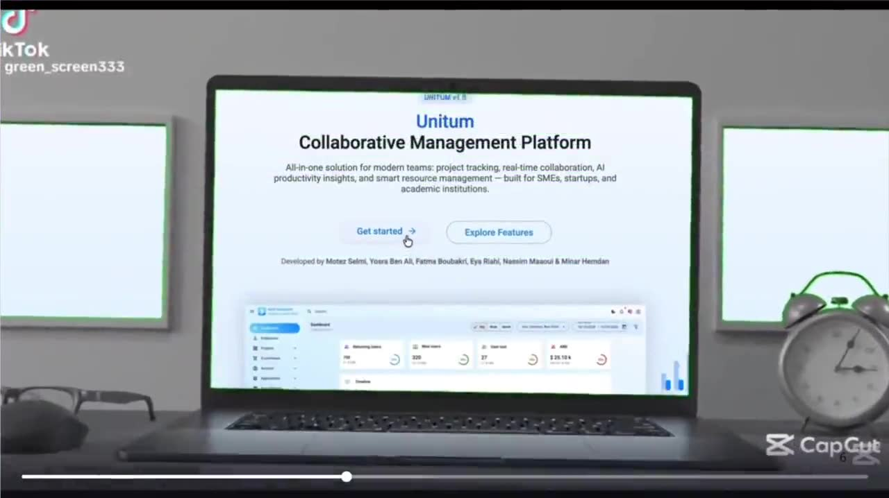
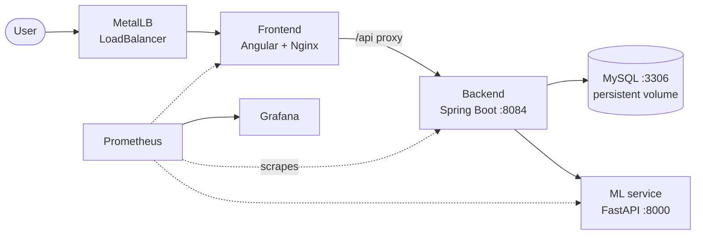
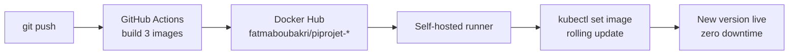
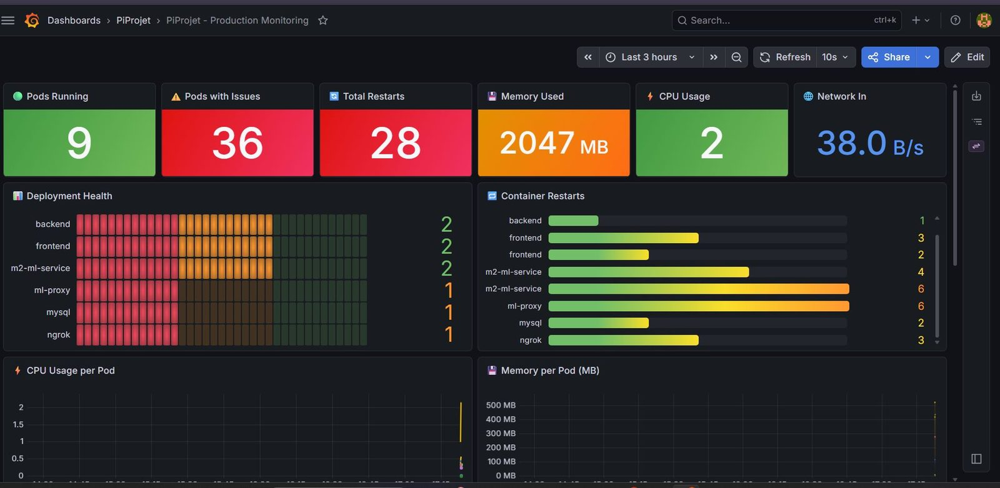
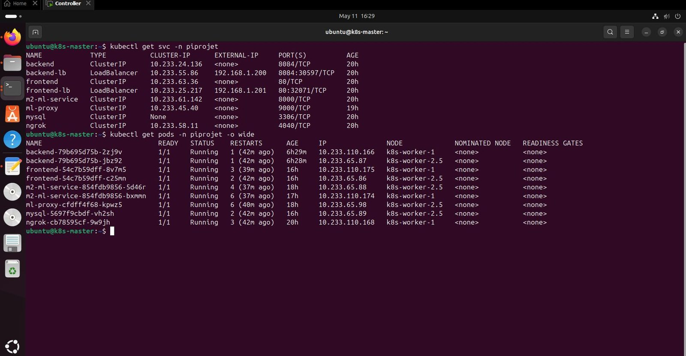
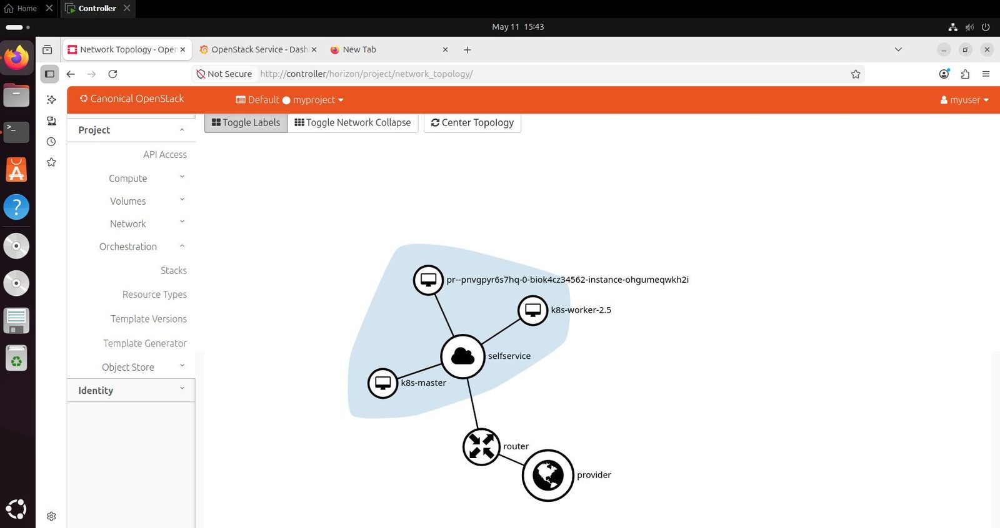
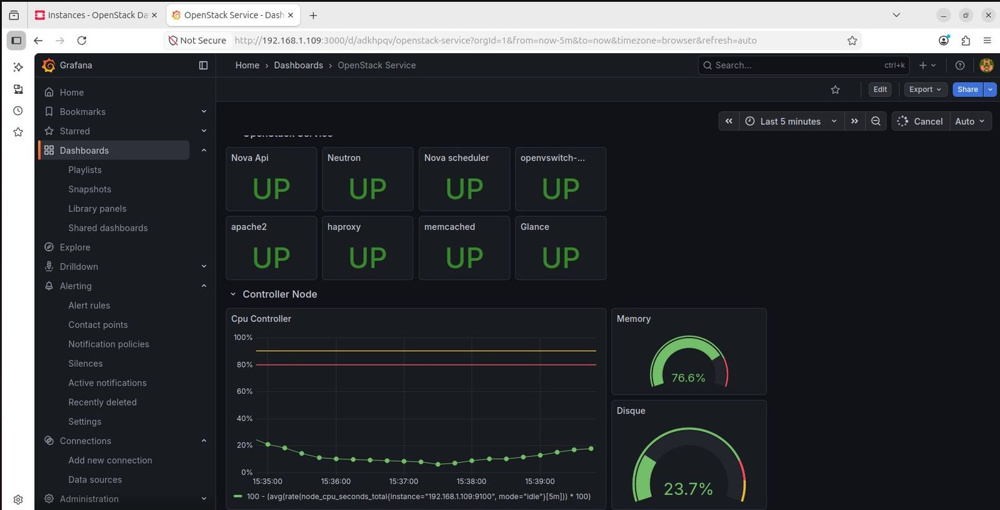

# Unitium — AI-Powered Project Management Platform

**🏆 1st Prize — Cloud Integration Project · ESPRIT Bal des Projets 2026 (13th edition)**
**🚀 Top 5 — EntreprenUp Hackathon**

Unitium brings tasks, sprints, files, team chat and Git into one platform for enterprise and academic teams, and uses AI to flag risks before they turn into delays. It runs as containerized microservices on Kubernetes, delivered by a fully automated CI/CD pipeline and monitored in real time.



---

## Features

**Product**
- Projects, tasks and sprints with an Eisenhower matrix and sticky notes
- Team chat rooms and a built-in Git workspace
- Role-based dashboards for managers, tutors and students
- Membership, access control, subscriptions and billing

**AI**
- **Deadline-risk prediction** with an LSTM model
- **Team recommendation** with XGBoost
- **Burnout detection** with NLP sentiment analysis
- Models served by a dedicated **FastAPI** microservice

---

## Architecture



All services talk to each other through **Kubernetes service DNS** (`backend:8084`, `mysql:3306`, `m2-ml-service:8000`), so no IP addresses are hard-coded. Configuration lives in ConfigMaps, credentials in Kubernetes Secrets.

---

## DevOps & Cloud

> 📦 All the Docker, Kubernetes, CI/CD and monitoring files are in the **[`dockerize-k8s-module2`](https://github.com/Boubakrifatma/unitium/tree/dockerize-k8s-module2)** branch.

### Containerization
- Multi-stage **Dockerfiles** for the 3 services: backend (Java), frontend (Angular served by Nginx) and ML service (Python)
- **Docker Compose** to run the full stack locally (MySQL, backend, frontend, ML service) with health checks and dependency ordering

### Kubernetes ([`k8s/`](https://github.com/Boubakrifatma/unitium/tree/dockerize-k8s-module2/k8s))
| Component | Manifests |
|---|---|
| Namespace | `00-namespace.yaml` |
| Backend | `backend-deployment.yaml`, `backend-service.yaml`, `backend-lb-service.yaml`, `backend-configmap.yaml` |
| Frontend | `frontend-deployment.yaml`, `frontend-service.yaml`, `frontend-lb-service.yaml` |
| ML service | `m2-ml-deployment.yaml`, `m2-ml-service.yaml`, `ml-configmap.yaml`, `ml-fallback-proxy.yaml` |
| Database | `mysql-deployment.yaml`, `mysql-service.yaml`, `mysql-pvc.yaml`, `mysql-configmap.yaml` |
| Networking | `metallb-config.yaml`, `ngrok-deployment.yaml`, `ngrok-service.yaml` |
| Monitoring | `monitoring-stack.yaml` (Prometheus, Grafana, node-exporter, kube-state-metrics) |

- **2 replicas** per service with **rolling updates** for zero-downtime releases
- **MetalLB** for external IPs, **ngrok** tunnel for public access
- **Nginx fallback proxy** for the ML service

### CI/CD ([`.github/workflows/ci-cd.yml`](https://github.com/Boubakrifatma/unitium/blob/dockerize-k8s-module2/.github/workflows/ci-cd.yml))



1. A push triggers **GitHub Actions**, which builds the frontend, backend and ML images.
2. The images are pushed to **Docker Hub**.
3. A **self-hosted runner** next to the cluster updates the 3 deployments.
4. Kubernetes performs a **rolling restart**: the new code goes live with zero downtime.

### Private cloud
The platform was deployed on a private cloud built with **OpenStack** (1 controller, 1 storage and 4 compute nodes), combined with **Azure** and **VMware**, and a **Kubernetes** cluster of 1 master and 2 workers provisioned with **Ansible**.

### Monitoring
| Cluster dashboard | Pods and services |
|---|---|
|  |  |

| OpenStack network topology | OpenStack monitoring |
|---|---|
|  |  |

---

## Tech stack

| Layer | Technologies |
|---|---|
| Frontend | Angular, TypeScript, Nginx |
| Backend | Java, Spring Boot 3, Spring Data JPA, MySQL |
| AI / ML | Python, FastAPI, LSTM, XGBoost, NLP |
| Containers | Docker, Docker Compose |
| Orchestration | Kubernetes, MetalLB, ngrok |
| CI/CD | GitHub Actions, Docker Hub, self-hosted runner |
| Infrastructure | OpenStack, Azure, VMware, Ansible |
| Monitoring | Prometheus, Grafana, node-exporter, kube-state-metrics |

---

## Run it

The deployment files are in the [`dockerize-k8s-module2`](https://github.com/Boubakrifatma/unitium/tree/dockerize-k8s-module2) branch:

```bash
git clone -b dockerize-k8s-module2 https://github.com/Boubakrifatma/unitium.git
cd unitium
```

### Locally with Docker Compose
```bash
docker-compose up --build
```
This starts MySQL, the backend, the frontend and the ML service.

### On Kubernetes
Credentials are **not stored in this repository**. Create the Secrets referenced by the deployments before applying the manifests, for example:

```bash
kubectl apply -f k8s/00-namespace.yaml
kubectl create secret generic mysql-secret -n piprojet --from-literal=MYSQL_ROOT_PASSWORD=<your-password>
kubectl create secret generic app-secret   -n piprojet --from-literal=<KEY>=<value>
kubectl create secret generic ngrok-secret -n piprojet --from-literal=NGROK_AUTHTOKEN=<your-token>
kubectl apply -f k8s/
```
Check the `secretKeyRef` entries in `k8s/*-deployment.yaml` for the exact key names.

More details: [`DEPLOYMENT.md`](https://github.com/Boubakrifatma/unitium/blob/dockerize-k8s-module2/DEPLOYMENT.md) · [`README_DOCKER.md`](https://github.com/Boubakrifatma/unitium/blob/dockerize-k8s-module2/README_DOCKER.md) · [`README_CICD.md`](https://github.com/Boubakrifatma/unitium/blob/dockerize-k8s-module2/README_CICD.md)

---

## Branches

| Branch | Content |
|---|---|
| `main` *(default)* | Application code: Spring Boot backend and Angular frontend |
| [`dockerize-k8s-module2`](https://github.com/Boubakrifatma/unitium/tree/dockerize-k8s-module2) | Full stack with Docker, Kubernetes, CI/CD and monitoring |
| [`IntegrationReadyToUse`](https://github.com/Boubakrifatma/unitium/tree/IntegrationReadyToUse) | Complete application with all AI services (risk prediction, NLP, sentiment model) |
| Feature branches | Chat rooms, billing, membership and access control, deadline timeline… |
